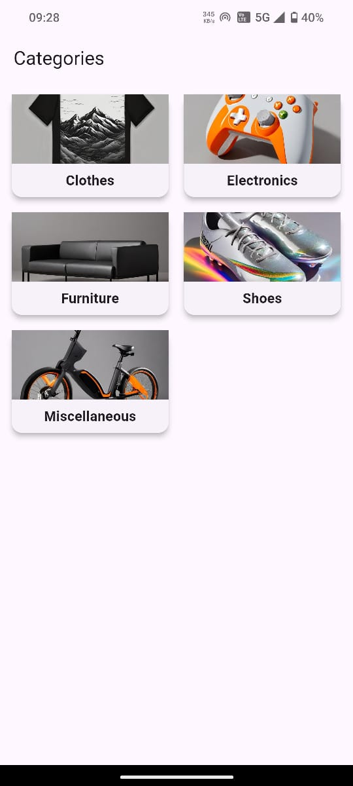
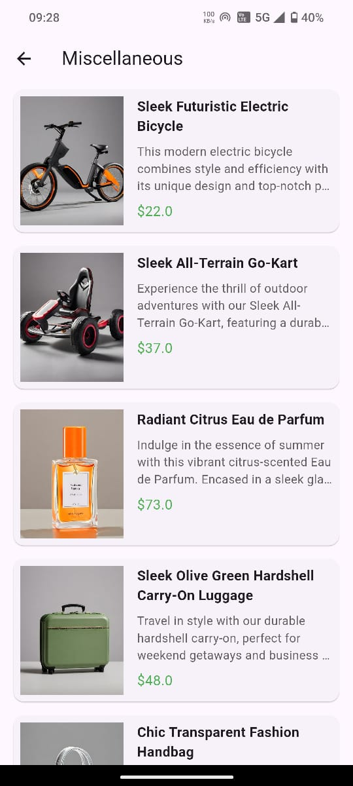

# Product
A Flutter application designed to display products categorized by their respective categories. Users can navigate between categories, view product details, and explore images in a slider format
# Features
Category Display: Categories are shown in a grid layout, allowing users to select and view associated products. 
Product Listing: Products under the selected category are displayed in a detailed list format. 
Image Slider: Each product displays multiple images in a carousel slider. 
Product Details: Information such as the product's name, price, and description are showcased for every item.
# Technologies Used
1. Flutter SDK
For building the cross-platform UI. 
2. Dart
Primary programming language for Flutter. 
3. Carousel Slider
Used for displaying product images in a carousel format. 
4.FutureBuilder
For handling asynchronous operations like fetching data from the repository. 
5.StatefulWidget
Used for managing state in components like ProductTile.
# image

